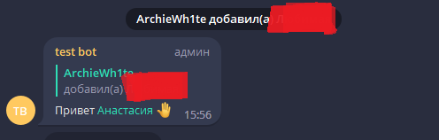
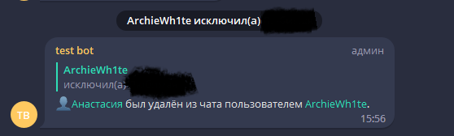
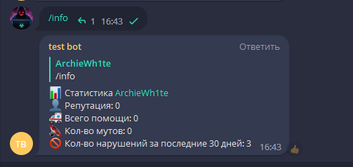
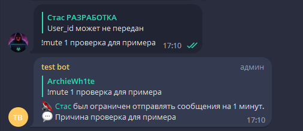
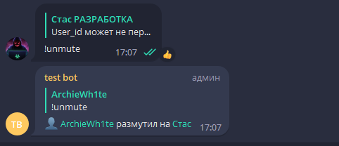

**Moderator_Bot v1.0**

**Author:** @ArchieWh1te

**Language:** Python 3.8

**framework for Telegram** Aiogram 2.23.1 

**License:** Free

### Бот модератор в группе / чате
**Запуск бота**

Для запуска бота используйте файл *app.py*

**Команды:**

**/info** - статистика пользователя

**!unmute / !mute время в минутах** - Команда для Администратора Снять и поставить мут

**Для работы вам потребуется:**

1)установить все зависимости из *requirements.txt*

2)Установить **PostgreSQL** и настроить его 

3)Отредактировать файл **.env** там указываете конфигурацию для подключения к **PostgreSQL**

4)Изменить настройки в файле **config** на свои параметры в переменной *admins*

**Скриншоты**

*Когда пользователь зашел в группу или его добавили*

*Когда пользователя удалили*

*Статистика*

*Дать мут*

*Снять мут*

*Удаление рекламных ссылок*

*Удаление плохих слов*

